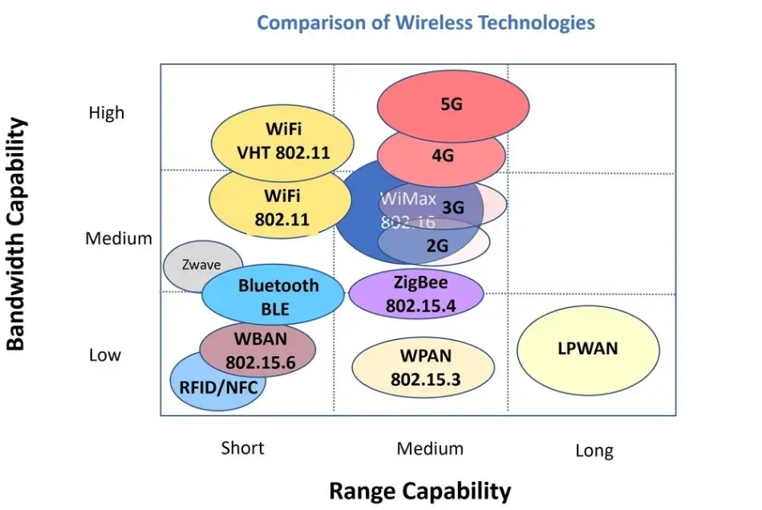

# Alternative Analysis

|                        | Alternative 1 ( Running EC2 VPN)                                                                                                                                                                                                                                                                                                                                                                          | Alternative 2 ( Running router) | Alternative 3 (reactivate 4g providers)                                                                      |
|------------------------|-----------------------------------------------------------------------------------------------------------------------------------------------------------------------------------------------------------------------------------------------------------------------------------------------------------------------------------------------------------------------------------------------------------|---------------------------------|--------------------------------------------------------------------------------------------------------------|
| Initial Cost           | $0.00                                                                                                                                                                                                                                                                                                                                                                                                     | $40.00                          | $0.00                                                                                                        |
| Monthly Cost           | $7.00                                                                                                                                                                                                                                                                                                                                                                                                     | $0.00                           | $90.00                                                                                                       |
| Expected Time (months) | 9.00                                                                                                                                                                                                                                                                                                                                                                                                     | 9.00                           | 9.00                                                                                                        |
|                        |                                                                                                                                                                                                                                                                                                                                                                                                           |                                 |                                                                                                              |
|                        | Description                                                                                                                                                                                                                                                                                                                                                                                               | IT and campus Involvement       | Benefit                                                                                                      |
| Alternative 1          | Initiate Eduroam wifi from the school and spin up VPN server                                                                                                                                                                                                                                                                                                                                              | High                            | Bypass IT firewall.  Student credential is stored on the sd card (security issue). Can deploy more services. |
| Alternative 2          | Purchase router to connect campus network                                                                                                                                                                                                                                                                                                                                                                 | Medium (due to isolation)       | Private network, but the cost is high when two stations are in different locations                           |
| Alternative 3          | Reactivate 4g providers $90 for 2 sensors station.                                                                                                                                                                                                                                                                                                                                                        | none                            |                                                                                                              |
| Alternative 4          | Activate 4g hotspot $25 per station                                                                                                                                                                                                                                                                                                                                                                       | none                            | private network, two stations can connect one hotspot.                                                       |
|                        |                                                                                                                                                                                                                                                                                                                                                                                                           |                                 |                                                                                                              |
| **Note** (An)            | I would recommend the first 2 months of the project to rely on the network campus without disclosing the services deployed, since most of the sensors don’t require a lot of bandwidth. However, throughout the project, the bandwidth will increase knowing video streaming services would be deployed and implemented (due to outdoor camera devices), which is believed to start in the Fall semester. |                                 |                                                                                                              |
| Researcher             | An Pham, Myriam Boutros.                                                                                                                                                                                                                                                                                                                                                                                  |                                 |                                                                                                              |

# Bandwith Comparison

- **LPAwan** is a new wireless technology that has lowest power consumption with longest range, and it is supported with AWS IoT Core. Consider this protocol for IoT sensors.

