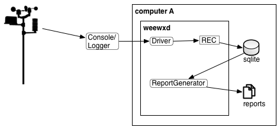

# Guide to Install Davis Weather Station
## Requirement:
- Raspberry pi 2/3/4 or Linux based compunter.
- Weather Sensor Station Example:
- Weather Station.
- DSL cable (R11/R12 cable) - used to connect sensors.
- Internet connection.
- SD card.

## Architecture and Diagram 
- The diagram belowed is used to convey the interaction of Davis Weather Station and weewx open source software.

## Installation Guide (Hardware)

- Connect all sensor cable to ISS box

- From Console port connect to Davis Envoy (Console Logger) via usb cable.

 
## Installation Guide (Software)

1. Install community garden script from the github for latest version by typing following command `git clone https://github.com/phamduchongan93/cgpi`
2. To verify version of  community garden software type `./communitygarden-cli -v`
3. To install weewx and database, type `./communitygarden-cli  --install-weewx`
4. To verify if weewx is running type `./communitygarden-cli --status-weewx`

!!! Note
    In case you want to reinstall weewx, type `./communitygarden-cli --uninstall-weewx`

### Troubleshoot:
- If the RF11 is broken, follow the clips below for instruction of replaring RF11 Connector
<iframe width="1229" height="400" src="https://www.youtube.com/embed/PjqzplpjJYQ" title="How to Crimp Rj11 Connector without Crimping tool" frameborder="0" allow="accelerometer; autoplay; clipboard-write; encrypted-media; gyroscope; picture-in-picture; web-share" allowfullscreen></iframe>
## Support

!!! Warning
    Internal Use Only: If you find any error, please open an issue at https://github.com/phamduchongan93/cgpi/issues. I will take a look asap.

